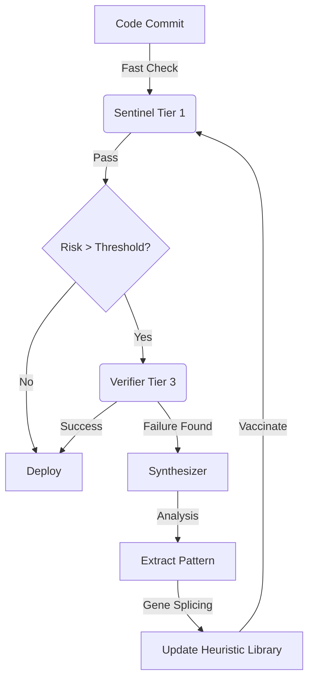

# The QoreLogic Endpoint: The Immunological Codebase

## A Strategy for Evolutionary Security at Scale

**Version:** 1.0  
**Date:** December 22, 2025  
**Based On:** `docs/research/` Analysis

---

## 1. The Logic of Convergence

After reviewing the full research corpus (Formal Methods, Information Theory, Behavioral Economics, Trust Dynamics), a singular architectural endpoint emerges. The system cannot rely solely on **Static Analysis** (limited by rules) or **Formal Verification** (limited by compute cost/halting problem).

To achieve **Infinite Scalability** with **Evolutionary Security**, the system must transition from a "Fortress" model to an **"Immune System"** model.

### The Core Loop

The endpoint of the QoreLogic logic is the **Automated Heuristic Synthesis Loop**:

1.  **Infection (Novel Bug):** A bug passes Tier 1 (Static) but is caught by Tier 3 (BMC) or Production Failure.
2.  **Antibody Generation (Synthesis):** The system analyzes the failure trace and generates a lightweight `HeuristicPattern` (Regex/AST) that covers the specific variant.
3.  **Vaccination (Distribution):** This pattern is pushed to all `Sentinel` nodes (Tier 1).
4.  **Immunity (Scale):** Future instances of this complex bug are now caught in **O(n)** time by Tier 1, rather than **O(2^n)** time by Tier 3.

---

## 2. Derivation from Research

This endpoint is the mathematical necessity of the research findings:

### A. From Formal Methods

- **Fact:** Full verification is impossible at scale (State Space Explosion).
- **Fact:** The "Small Scope Hypothesis" proves that most bugs have small footprints.
- **Conclusion:** We don't need to verify _everything_ deeply. We only need to verify _novel_ patterns deeply, then "compress" that knowledge into cheap heuristics.

### B. From Information Theory

- **Fact:** Trust decays over time/distance (Data Processing Inequality).
- **Solution:** **Signed Heuristics**. By treating protection patterns as "Signed Information Objects", we ensure that security knowledge propagates without decay (The "Zero-Hop" Mandate).

### C. From Behavioral Economics

- **Fact:** HILS (High Inspection, Low Severity) works best.
- **Application:** The "Immune System" provides **100% Inspection** (via cheap Heuristics) which enables the HILS model to function effectively. Without cheap heuristics, inspection is rare (high cost), forcing a suboptimal LIHS model.

---

## 3. The Architecture of the Endpoint

### 3.1 Components

1.  **The Sentinel (T-Cell):** Fast, pattern-matched scanning. (Exists: `SentinelEngine`).
2.  **The Verifier (B-Cell):** Deep, expensive analysis. (Exists: `CBMCVerifier`).
3.  **The Synthesizer (The Brain):** _New Component_. Bridges the two.

### 3.2 The Evolutionary Cycle

---

## 4. Why This "Truly Scales"

- **Computational Efficiency:** The heavy lifting (BMC) is only done _once per bug class_. The mitigation (Regex) runs _billions of times_ at near-zero cost.
- **Knowledge Accumulation:** The codebase becomes "smarter" with every failure. It does not just get "fixed"; it gets "hardened".
- **Anti-Fragility:** The more the system is attacked (or bugs found), the robust the Tier 1 filters become.

## 5. Conclusion

The "Endpoint" of QoreLogic is not a perfectly verified codebase (impossible), but a **Self-Optimizing Verification Pipeline**. By closing the loop between **Deep Verification** and **Shallow Scanning**, QoreLogic achieves the goal of a system that becomes more secure and more efficient as it grows.
